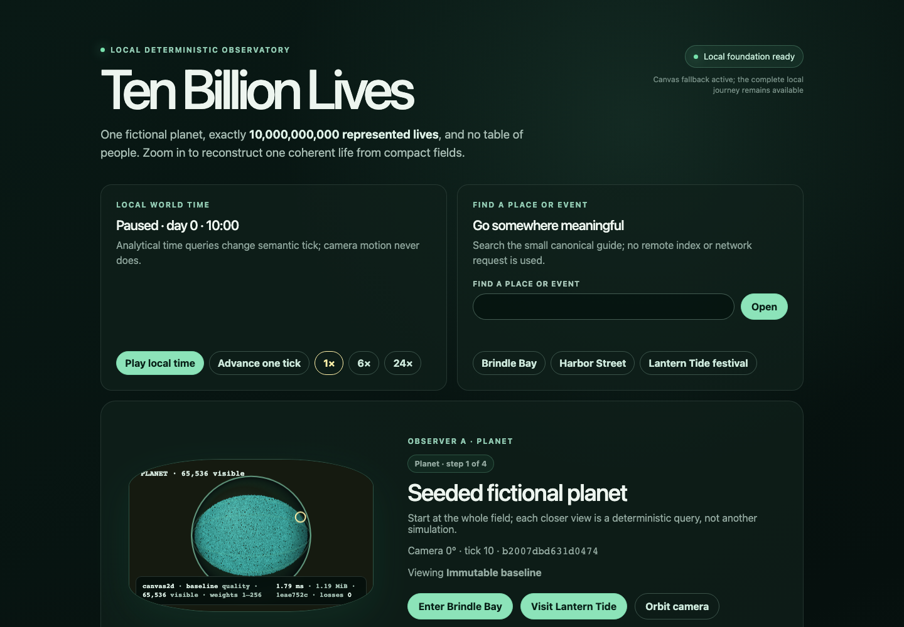

# Ten Billion Lives

One compact planetary field. Exactly ten billion represented lives. Zoom from a fictional planet to Brindle Bay, Harbor Street, and one reproducible person; then initialize a second local observer and see the same identity, itinerary, relationships, and events without a ten-billion-row table.

Ten Billion Lives is a validated local-first browser MVP. Its authoritative simulation uses conserved integer population, activity, place, and mobility fields. Pure seeded queries reconstruct stable local people from that shared state, while WebGPU or Canvas draws a disposable view. Everything runs on one machine with no runtime API, account, server protocol, or remote data source. The final clean-checkout audit is retained in [the issue #27 evidence index](docs/evidence/issue-27/INDEX.md).



## What it demonstrates

- The baseline represents exactly **10,000,000,000** fictional people at initialization and after every tick.
- Camera-independent queries recover the same person, household, itinerary, relationships, encounters, and event membership for the same semantic inputs.
- Two independently initialized local views reproduce the same semantic identity and event hashes.
- Snapshot restore and replay converge on committed hashes.
- A complete Planet → Settlement → Street → Person → Festival → Replay → Field reveal journey works in Chromium, WebKit, mobile emulation, and the Canvas fallback.

The project does **not** run ten billion independent minds or agent loops. It demonstrates coherent apparent individuality reconstructed from compact fields. It is a software and product experiment, not evidence for a physical or social theory.

## Quickstart

Prerequisites are Node.js 24.18.0 and pnpm 11.24.0. From a clean checkout:

```sh
nvm install
corepack enable
corepack install --global pnpm@11.24.0
pnpm install --frozen-lockfile
pnpm start
```

`pnpm start` builds every package and launches the production browser app on the printed loopback URL, normally `http://127.0.0.1:4173`. Stop it with Ctrl-C. The detailed [quickstart and troubleshooting guide](docs/QUICKSTART.md) covers browser installation, fallback behavior, snapshots, ports, and build failures.

## Guided journey

1. Confirm the header says `10,000,000,000 represented lives` and the world time is paused.
2. Enter **Brindle Bay**, then **Harbor Street**, and select the highlighted resident.
3. Inspect the stable person ID, household, role, itinerary, relationships, encounters, and local semantic events.
4. Initialize observer B and confirm **Semantic match**.
5. Visit **Lantern Tide**, follow a departure, and compare the reversible closure branch.
6. Rewind and replay, then reveal the field/reality budget: 2,048 authoritative integer cells, zero stored person rows, weighted visible projections, and state/event hashes.

The [product contract](docs/PRODUCT.md) explains the complete five-minute story and the exact success criteria.

## Local validation

```sh
pnpm exec playwright install chromium webkit
pnpm check
pnpm test:e2e
pnpm qa:replay
pnpm qa:benchmarks
```

`pnpm check` includes formatting, spelling, local documentation links/snippets, lint, strict types, 76 deterministic unit/contract tests, and the production build. The independent #25 gate passed 24 applicable browser cases with zero unexpected or flaky outcomes. All current performance budgets passed; the retained 30-minute soak stayed within its frame and memory budgets. See [testing and evidence](docs/TESTING.md) and [benchmark methodology](docs/BENCHMARKS.md).

## Architecture at a glance

```text
seed + commands → integer world fields → snapshot/state/event hashes
                                      ↘ pure manifestation queries
                                        → semantic people/events
                                          → WebGPU or Canvas projection
```

`packages/sim` owns authority and replay; `packages/manifest` derives people and itineraries; `packages/render` projects immutable scenes; `packages/testkit` owns fixtures and regression helpers; `apps/web` composes the local observer. Camera and renderer state never flow back into authority. The full [architecture contract](docs/ARCHITECTURE.md) includes equations, package boundaries, data flow, identity construction, determinism, formats, and LOD semantics.

## Known limitations

- This is a fictional, one-day analytical demonstration, not a demographic model, historical simulation, consciousness model, or scientific validation of emergence.
- Visible figures are weighted deterministic manifestations; visual density changes with local capability while semantics do not.
- Chromium 151 and WebKit 26.5 are validated locally. Firefox was unavailable on the validation machine and is not claimed as tested.
- WebGPU is optional. Canvas preserves the complete journey with fewer visible tokens.
- Person links are local reconstruction references, not remote shared sessions.

The complete [claims, non-claims, and limitations](docs/LIMITATIONS.md) are part of the product contract, not fine print.

## Documentation

- [Quickstart and troubleshooting](docs/QUICKSTART.md)
- [Product story and guided journey](docs/PRODUCT.md)
- [Architecture, equations, packages, data flow, identity, and LOD](docs/ARCHITECTURE.md)
- [Living-city visual, time, interface, evidence, and ownership contract](docs/LIVING_CITY.md)
- [Determinism](docs/DETERMINISM.md) and [snapshot/event formats](docs/FORMATS.md)
- [Browser and accessibility support](docs/COMPATIBILITY.md)
- [Benchmark methodology and baseline](docs/BENCHMARKS.md)
- [Testing and evidence](docs/TESTING.md)
- [Dependencies and licenses](docs/DEPENDENCIES.md)
- [Field-first emergence: conceptual note](docs/CONCEPT.md)
- [Contributing](CONTRIBUTING.md)

## Deferred networking and deployment

Networking, shared remote observation, deployment, cloud services, CI, Pages, containers, and production operations are deliberately absent. They will be planned only after the local MVP is validated, under separate deferred issues. This repository contains no deployment or server runbook.

## Contributing and license

GitHub issues and milestones define scope and dependency order. Read [CONTRIBUTING.md](CONTRIBUTING.md) and the current issue before changing code. The project is available under the [MIT License](LICENSE), and its runtime/development dependency licenses are documented in [docs/DEPENDENCIES.md](docs/DEPENDENCIES.md).
