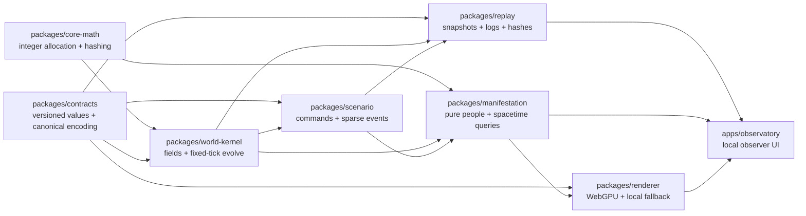
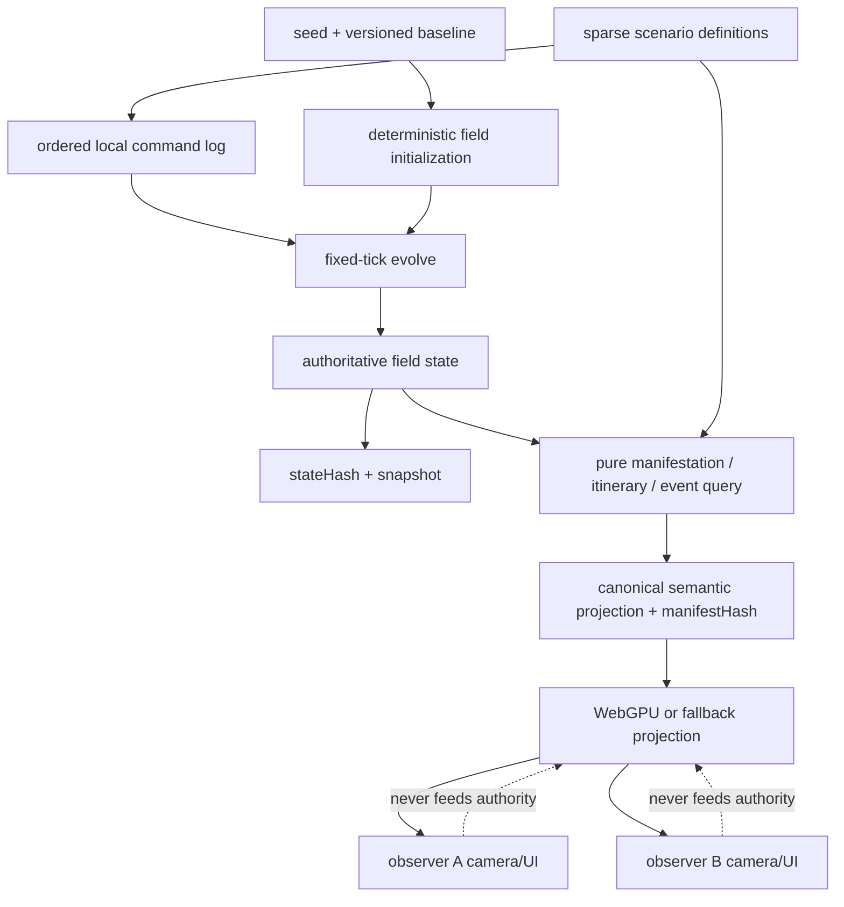

# Local architecture contract

This document fixes the smallest technical contract needed to deliver the [local MVP product journey](PRODUCT.md). It describes authoritative semantics; later issues may refine internal representation only when the same invariants, serialized contracts, and golden vectors remain true.

## Invariants and authority

The local world has one authoritative state. Its non-negotiable invariants are:

1. The baseline population sum is exactly **10,000,000,000** at initialization and after every tick.
2. Population is never represented by a ten-billion-row person table. It is conserved across bounded field cells and activity/flow buckets.
3. Authoritative population, capacity, allocation, time, and fixed-point values are integers. TypeScript `bigint` stores population and intermediate arithmetic that could exceed safe integer range; snapshots encode it as canonical base-10 strings. Integer identifiers and ticks may use `number` only while tests prove they remain in the safe-integer range.
4. State mutation occurs only in the fixed-tick world kernel through canonical commands. Queries, cameras, renderers, frame rate, visibility, pointer input, and wall-clock observation time cannot mutate it.
5. Manifestation, itinerary, encounter, and event queries are pure. Equal versioned inputs produce byte-for-byte equal canonical semantic outputs.
6. GPU resources and pixels are projections. They never feed state, identity, event, replay, or hash decisions.

Authority is intentionally narrow:

| Data | Owner | Authoritative? |
| --- | --- | --- |
| Seed, schema/kernel versions, branch, tick, population/activity/place/mobility fields | world kernel | yes |
| Ordered scenario commands and sparse event definitions | scenario log | yes |
| Snapshot and command/event hashes | replay layer over canonical state | yes |
| Person, household, itinerary, relationship, encounter, and local event projections | pure manifestation queries | derived but semantically reproducible |
| Camera, selection, pane layout, quality tier, animation interpolation | local observer UI | no |
| Meshes, buffers, particles, colors, pixels, frame timing | renderer | no |

## Deterministic world evolution

The kernel advances one one-minute tick at a time:

```text
S[t+1] = evolve(S[t], commands[t])
```

`S[t]` contains only versioned canonical data. `commands[t]` is sorted by `(tick, commandKind, stableId)` before application. A duplicate stable command identifier is rejected. The kernel does not read dates, random globals, locale APIs, wall clocks, camera state, GPU results, object iteration order, or asynchronous completion order.

All division uses a named integer rule (floor unless the domain contract says otherwise). Conservation allocations use largest remainder with stable identifier tie-breaking. Fixed-point scales live beside their field definitions; implicit floating-point conversions are forbidden in the kernel. Development assertions check safe ranges and the population invariant at every transition. Canonical hashing uses explicitly ordered fields and encoded integer values, never default object serialization.

The baseline is a deterministic 1,440-tick day. Direct seeking loads a compatible checkpoint and evolves canonical commands to the target tick. Playback rate changes how quickly ticks are requested, not the result of a tick.

## Pure manifestation and identity

The query boundary is:

```text
V = manifest(seed, checkpoint, region, tick, lod)
```

- `seed` identifies the fictional baseline.
- `checkpoint` supplies the compatible world/schema versions, branch, canonical field state, and `stateHash` needed by the query.
- `region` is a canonical semantic cell or bounds identifier, not screen coordinates.
- `tick` is an integer baseline tick.
- `lod` is a named semantic sampling profile with committed thresholds and weights, not a floating camera distance.

The output `V` is a canonically ordered immutable value containing the query context, weighted manifestations, analytical locations/activities, and relevant sparse events. It never mutates or refines the checkpoint. The UI may choose which explicit region/profile to request, but calling more, fewer, or differently ordered queries cannot change any query result or future world state.

An identity epoch is the tuple `(identitySchemaVersion, seed, baselineBranch)`. Within it, a represented person has a stable population address `(homeCellId, localOrdinal)`. `personId` is a domain-separated deterministic hash of the epoch and address. Household, workplace/school/leisure anchors, and symmetric relationship edges derive from the same address space with canonical ordering. A structured population address remains available in fixtures to detect hash collisions; a collision is a correctness failure, not permission to merge identities.

Daily itineraries are analytical piecewise segments derived from identity, place anchors, route data, branch, and tick. Asking for a later tick does not run or retain a private agent loop. Encounter queries intersect canonical itinerary segments in spacetime and return stable, sorted pairs. Re-querying after eviction or reload reconstructs the same result.

## Two-observer semantic contract

Two independently initialized local observers given the same identity epoch, compatible snapshot, branch, tick, region, and LOD profile must agree exactly on:

| Domain | Fields that must match |
| --- | --- |
| World context | schema/kernel/identity versions, seed, branch, tick, `stateHash`, `eventHash` |
| Person | `personId`, population address, represented weight, home, household, role, and work/school/leisure anchors |
| Relationships | relationship kind, endpoint IDs, symmetry, and canonical order |
| Itinerary | segment IDs, start/end ticks, origin/destination, route, activity, and integer progress inputs |
| Moment | canonical location/place, activity, qualifying encounter IDs, event IDs, and membership |
| Sparse events | event ID/type, branch, start/end tick, place, capacity/demand fields, participants selected by semantic query, and ordered semantic payload |

`stateHash` covers canonical authoritative state. `eventHash` covers the ordered scenario/event prefix through the tick. Derived query results also expose a `manifestHash` so tests can compare the full semantic projection.

Observers need not match camera, selected panels, frame count, interpolation, particles, mesh density, antialiasing, colors, text wrapping, or pixels. The two-observer proof uses panes, tabs, windows, or two app objects initialized from the same local fixture; it introduces no communication service.

## Snapshot and replay compatibility

A local snapshot envelope contains:

- `snapshotSchemaVersion`, `kernelVersion`, `identitySchemaVersion`, and canonical encoding version;
- seed, baseline/intervention branch, tick, and command-log cursor;
- all authoritative field arrays and totals, with wide integers as canonical decimal strings;
- ordered sparse-event state needed at the checkpoint;
- `stateHash` and `eventHash` computed from the canonical envelope payload.

The append-only local command log records version, stable ID, target tick, kind, and a kind-specific integer/string payload. Observer actions are absent. A replay loads the newest compatible snapshot at or before its target, verifies hashes, applies the sorted command suffix, and verifies the expected golden hashes. Replaying from tick zero and from an intermediate checkpoint must converge.

Reload recovery uses the same path: parse, validate schema, validate integer ranges and conservation, verify hashes, then expose state. Unknown major versions, versions newer than the reader, missing required fields, malformed integers, and hash mismatches fail visibly without partial recovery. Backward compatibility exists only through an explicit pure migration with old/new golden fixtures; there is no silent best-effort coercion. Minor additive fields must define canonical defaults. Issue #10 freezes the first supported envelope and golden replay vectors.

## Package boundaries

The repository uses a small TypeScript workspace with one-way dependencies. Names describe public responsibilities rather than permission to create extra services.



- `core-math`, `contracts`, `world-kernel`, `scenario`, `manifestation`, and `replay` are platform-neutral and cannot import DOM, browser, renderer, or application modules.
- `world-kernel` cannot import manifestation or renderer code.
- `manifestation` consumes readonly contracts/checkpoints and returns plain canonical values.
- `renderer` receives readonly projections and capability/quality settings; it cannot issue world commands.
- `apps/observatory` owns cameras, controls, local persistence adapters, and composition. Two app instances can be constructed against the same immutable input with separate UI state.
- Tests may depend on public package APIs and explicit fixture helpers, never renderer pixels for semantic assertions.

## Data flow



For the product journey, planet and settlement views read aggregate world fields; street/person/festival views request manifestations; the second observer repeats those queries independently; rewind uses snapshot plus replay; field reveal shows the authoritative and derived values already present at these boundaries.

## Rendering and LOD

LOD changes cost and density, not world truth. Each named profile defines a deterministic nested sample of population addresses and an integer `representedWeight` for each visible manifestation. One visible manifestation therefore means “this stable sampled identity visually stands for this many represented people in this cell/profile,” never “one stored simulated agent.” Weights plus any explicitly reported unsampled remainder reconcile to the queried field population.

Nested selection uses stable priority keys so an identity retained at a coarser profile has the same semantic fields at finer profiles. Cross-fades and interpolated motion are GPU/UI concerns and cannot enter `manifestHash`. Picking resolves a rendered stable key back to the semantic projection. The renderer exposes a WebGPU path and a deterministic, usable local fallback; both consume the same semantics even though their pixels differ.

## Sparse events and interventions

Lantern Tide and its harbor connector are versioned scenario definitions with stable IDs, places, tick ranges, integer capacities/demand, and deterministic membership predicates. They exist whether or not any observer visits Brindle Bay. Observation never creates, advances, populates, or retires an event.

The intervention is a separate branch command applied to a baseline checkpoint. Branch identity is an input to state, event, itinerary, and manifestation hashes. Baseline data remains immutable; both branches independently conserve 10,000,000,000 people. Only explicit scenario commands alter capacity or routes.

## Risk register and validation owners

Every material assumption has a later falsifier and a simple local fallback.

| Risky assumption | Objective validation owner | Simplest fallback if the budget/claim fails |
| --- | --- | --- |
| Browser `bigint` and canonical hashing are fast enough | golden vectors #6; benchmark profile #4 and #22 | keep wide arithmetic at conservation boundaries and cache immutable canonical encodings |
| Seeded geography can allocate exactly ten billion | allocation/conservation tests #7 | reduce field resolution, never relax the total |
| Fixed-point field movement remains conservative | property and long-run tests #8 and gate #10 | simpler integer transfer rules with stable remainder allocation |
| A deterministic day can express settlements and transport | scenario invariants #9 and replay gate #10 | fewer route/activity classes while preserving the journey |
| Snapshots and logs replay compatibly | checkpoint/direct replay golden tests #10 | support one explicit schema version and reject all others |
| Stable person/household/relationship projection is collision-free and believable | fixture/property tests #11 | expose structured population addresses and reduce relationship variety |
| Analytical itineraries produce stable encounters | spacetime intersection tests #12 | reduce to fewer piecewise route segments |
| WebGPU is available and materially useful | visual/performance tests #13, #22, #23 | use the committed Canvas/DOM local fallback with fewer visual instances |
| Weighted LOD reconciles fields and stays camera-independent | conservation/nesting/two-query tests #14 | use fewer named profiles and explicit remainder reporting |
| The complete semantic journey composes | real-browser milestone gate #16 | simplify presentation without removing a contract step |
| UI exposes time, narrative, and reality budget clearly | browser inspection #21 and QA #25 | retain a compact text-first inspector |
| Startup, frame, and memory budgets hold | same-profile benchmarks #22 and QA #25 | lower renderer quality/visible sample count, never authoritative fidelity |
| Keyboard, touch, browsers, and fallback remain usable | accessibility/browser matrix #23 and #25 | text-first controls and fallback renderer |
| Clean-checkout handoff is reproducible | documentation audit #26 and final gate #27 | reduce commands/dependencies rather than add remote infrastructure |

## Rejected alternatives

- **Floating-point or GPU authority:** hardware/compiler variation undermines conservation and replay; GPU work remains disposable projection only.
- **One stored record or loop per represented person:** contradicts the compact-field claim and cannot fit local memory or compute budgets.
- **Camera-triggered world refinement:** makes observation order causally alter truth. Queries may request explicit immutable projections, never mutate/refine state.
- **Observer-triggered events:** makes unvisited places semantically undefined and breaks independent observer equality.
- **A mutable global PRNG stream:** call order changes outputs. Random-looking choices use domain-separated hashing of stable semantic inputs.
- **Networking before local proof:** adds protocol, synchronization, deployment, and operations risk without validating the core concept. The second observer is local and independently initialized.
- **Pixel-perfect equality:** renderer and GPU differences are expected; only canonical semantics and hashes are exact.

## Out of scope

Server processes, WebSocket design, networking, shared remote state, CI, GitHub Pages, containers, deployment, cloud resources, production operations, runtime LLMs, and paid APIs are outside the local architecture. Issues labeled `phase:deferred` cannot become dependencies. Local files, in-memory app instances, panes/tabs/windows, and a loopback production preview are sufficient for all MVP evidence.

## Architecture review against the journey

| Journey step | Contract path | Validation gate |
| --- | --- | --- |
| Planet and exact total | baseline → integer fields → aggregate projection | #5, #10, #27 |
| Settlement and festival | world fields + observer-independent sparse scenario | #5, #16, #25 |
| Street and person | region/LOD query → stable address → person/itinerary projection | #5, #16 |
| Second observer | duplicate immutable inputs → exact semantic/hash comparison | #16, #25, #27 |
| Rewind | compatible snapshot + ordered command suffix → verified hashes | #10, #16, #27 |
| Field reveal | authoritative state + derived projection + renderer counts | #16, #21, #27 |

This review leaves no product step dependent on camera state, per-person storage, networking, or GPU authority.
