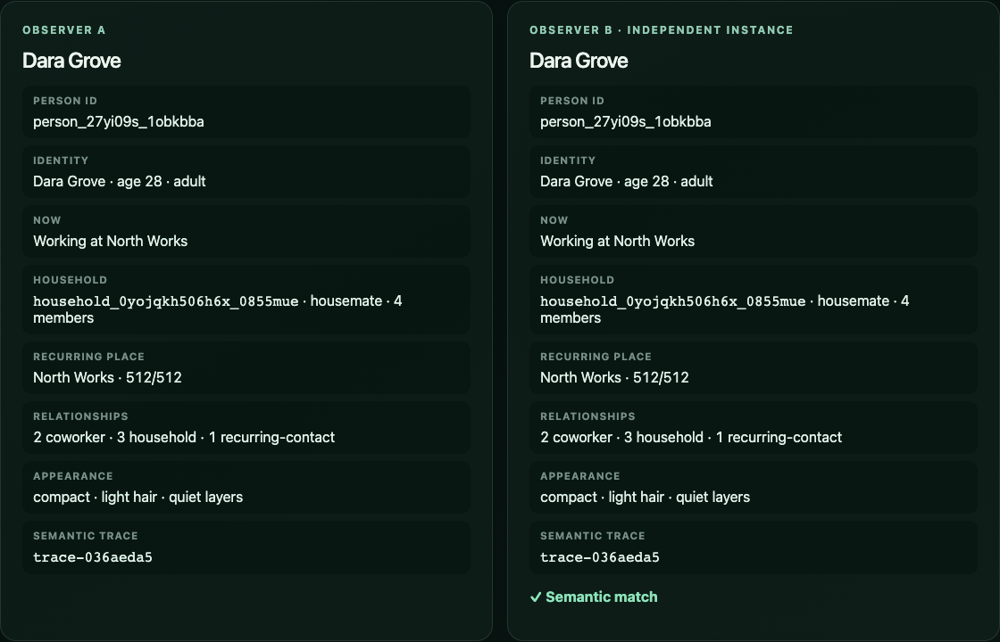

# Issue 11 evidence — stable procedural people

## Automated behavior

- `pnpm --filter @ten-billion-lives/manifest test` covers deterministic reconstruction, the committed golden vector, exact cohort and place boundary ranks, reciprocal household/place/relationship membership, invalid opaque identifiers, query purity, distribution sampling, and 100,000 collision-free identifiers.
- `pnpm person:vector` emits the same 900 JSON bytes from independently initialized Node processes (SHA-256 `56622fb390119eadff050711929e057f9574577a8ae0878705b97462c49aabc3`). The golden person is `person_27yi09s_1obkbba` with semantic hash `036aeda537b40d7e`, household `household_0yojqkh506h6x_0855mue`, and workplace `place_wrk_0vq6m09loyq6c_1oxppg2`.
- `pnpm test:e2e` runs the planet-to-person path in Chromium and WebKit. Both independently initialized observer views resolve the same person and household, report a semantic match, and reproduce `trace-036aeda5` after rewind.
- `pnpm check` is the documented root validation and includes formatting, lint, type checks, unit/contract tests, and the production build. Browser checks run separately with `pnpm test:e2e`.

The immutable fixture is [`packages/manifest/fixtures/person-golden-v1.json`](../../../packages/manifest/fixtures/person-golden-v1.json). It locks the person card, household membership, and reciprocal relationship adjacency against accidental drift.

## Scale and distribution

`pnpm benchmark:manifest` writes [`benchmarks/results/manifestation.json`](../../../benchmarks/results/manifestation.json) and fails when a committed budget is exceeded.

| Measurement                   |      Result |      Budget |
| ----------------------------- | ----------: | ----------: |
| Index build p95               |    13.45 ms |   <= 100 ms |
| Person queries p50            |    28,487/s | >= 20,000/s |
| Relationship queries p50      |    15,412/s |  >= 2,000/s |
| One million opaque IDs        | 3,407.93 ms | <= 5,000 ms |
| Collisions in one million IDs |           0 |           0 |
| Retained index heap           |    0.35 MiB |    <= 8 MiB |
| Retained person rows          |           0 |           0 |

The benchmark's 100,000-person deterministic sample was 22,007 young, 61,996 adult, and 15,997 older, tracking the exact 22%/62%/16% largest-remainder quotas. Boundary tests prove every assigned rank belongs to exactly one cohort and a place whose membership never exceeds its fixed capacity (school 256, workplace 512, service circle 128).

## Browser evidence

The screenshot was captured from the production preview with `node scripts/capture-person.mjs`. It visibly records the matching person ID, identity, activity, household, recurring place and capacity, relationship summary, appearance, and semantic trace in both observer instances.

## Architecture check

The manifestation index retains 2,048 compact cell prefix/quota records for exactly 10,000,000,000 represented people and zero person rows. Opaque person IDs are reversible keyed permutations over that exact domain; household, place, demographic, appearance, and reciprocal relationship data are reconstructed on demand without mutable query state.
