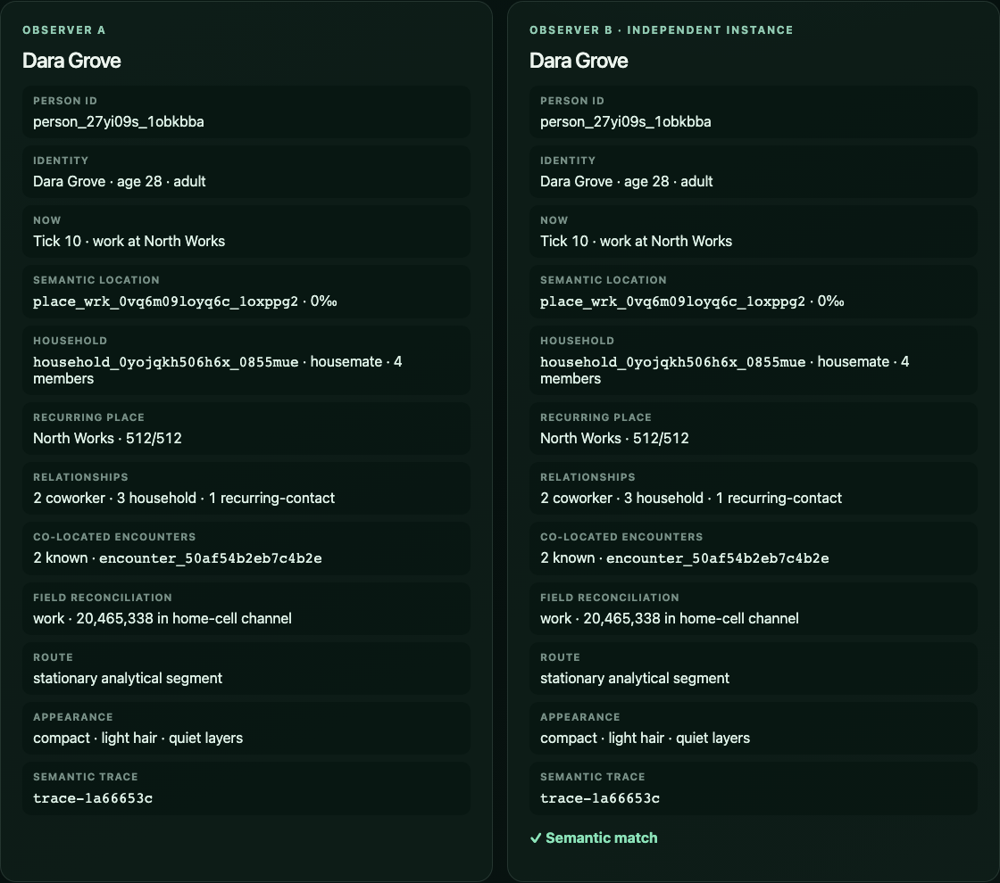
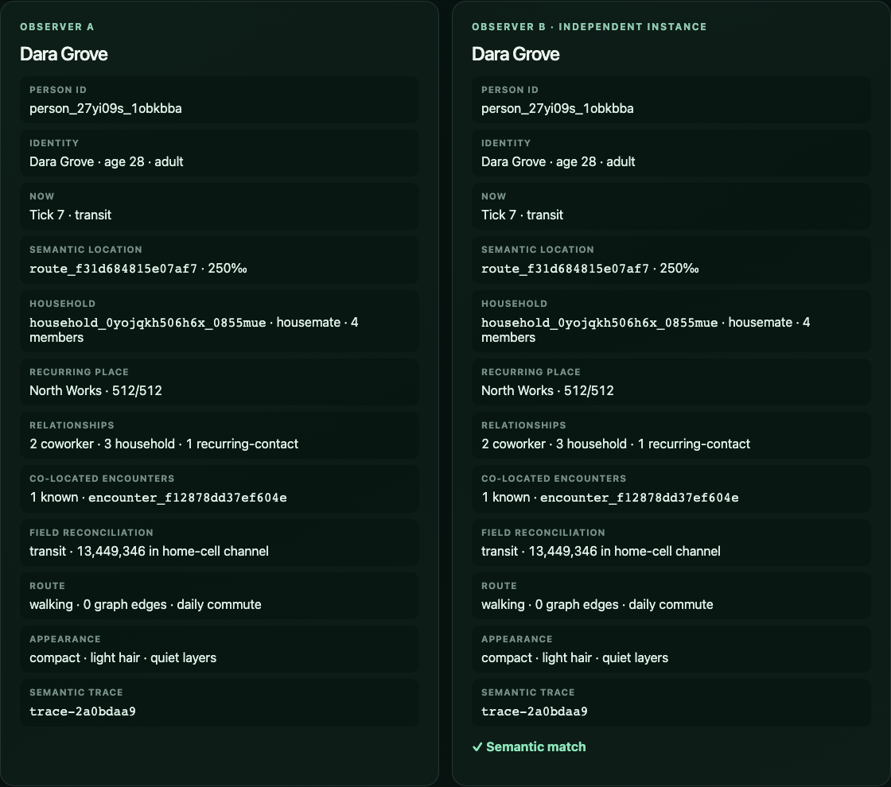

# Issue 12 evidence — analytical itineraries and encounters

## Deterministic traces

- `pnpm itinerary:vector` reconstructs a representative adult's 24-hour day plus the next midnight, a selected route-closure traveler at ticks 7–9, and a selected festival attendee at ticks 17–22.
- Two independently initialized Node processes emitted identical 40,442-byte JSON documents with SHA-256 `a10d12c3c6ef6ae9961f2a04d41f63ee80a9f9cdd6d2216f1448a8adf492fc92`.
- [`itinerary-golden-v1.json`](../../../packages/manifest/fixtures/itinerary-golden-v1.json) locks 25 hourly activity/location/encounter/hash points. It separately locks the signature edge's 31-edge open detour at ticks 7–8, direct one-edge route after the tick-9 reopen, and peak attendance at `festival/lantern-confluence`.
- The focused suite issues repeated and deliberately out-of-order queries, scrubs person and region LODs, verifies midnight rollover, and rejects negative, invalid-ID, wrong-world, and mismatched state/tick contexts without retaining resident state.

## Layer and encounter consistency

- Young, adult, and older representatives resolve to school, workplace, and service-circle activity at tick 10. Each query reports its exact home-cell cohort population and a nonzero matching field channel.
- Household and recurring-place encounters are included only when both reciprocal relationship endpoints independently resolve to the same semantic location at the same day/hour. The test follows a coworker edge in both directions and verifies one encounter-group identity and one location.
- LOD changes only `viewLocationId`; the authoritative activity, semantic location, and trace hash are camera- and LOD-independent.
- Route queries use actual intercity graph edges. Kernel close/open events define replan epochs; no query advances a resident or mutates a prior result.

## Performance

`pnpm benchmark:itinerary` writes [`analytical-itinerary.json`](../../../benchmarks/results/analytical-itinerary.json) and enforces these full-query budgets. A full query includes identity reconstruction, analytical activity/location, field reconciliation, route selection, reciprocal encounter filtering, LOD projection, and hashing.

| Measurement              |      Result |      Budget |
| ------------------------ | ----------: | ----------: |
| Index build p95          |    21.24 ms |   <= 125 ms |
| Full queries p50         |     2,710/s |  >= 2,000/s |
| 10,000 mixed-LOD queries | 3,673.26 ms | <= 5,000 ms |
| Retained index heap      |    0.39 MiB |    <= 8 MiB |
| Retained person rows     |           0 |           0 |

The workload queries tick 10 against one immutable authoritative world state and represents exactly 10,000,000,000 people.

## Browser evidence

`pnpm test:e2e` passed all 6 journeys in Chromium and WebKit. The production planet-to-person path initializes two local observers, directly scrubs work, commute, and evening ticks, and asserts matching activity and semantic identity after each query.

Both screenshots were captured from the production preview with `node scripts/capture-itinerary.mjs` and visually inspected. They retain person, place, field, route, encounter-group, and semantic-trace diagnostics for both observers.
