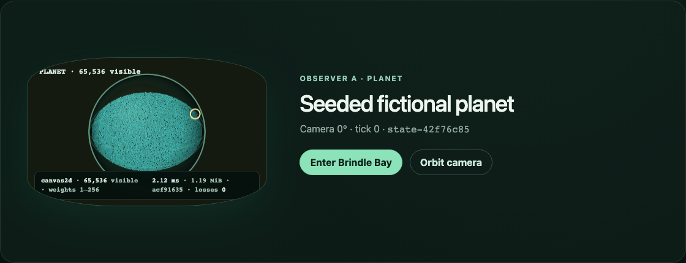
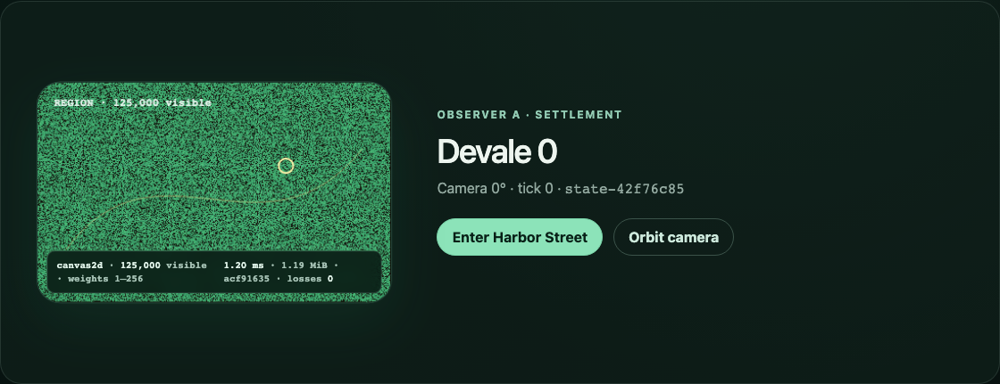
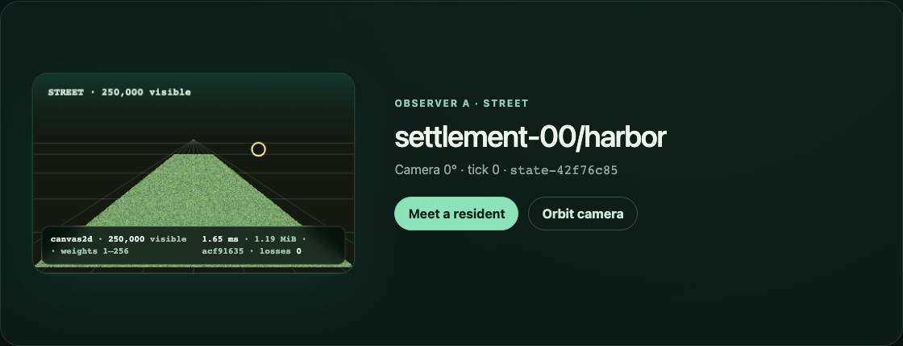
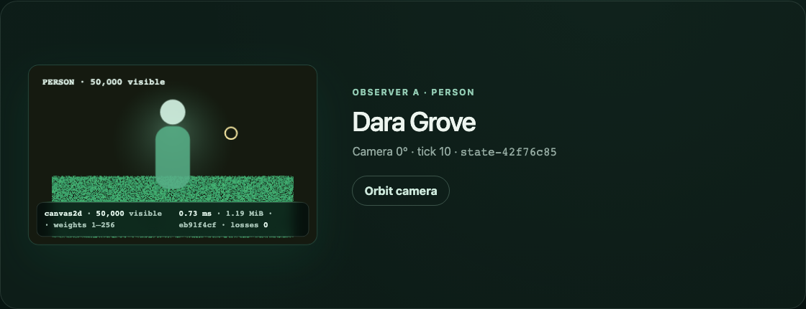

# Issue 13 evidence — multi-LOD renderer and fallback

## Render architecture

- `createRenderScene` derives render-owned typed buffers from immutable world/state/selection inputs. The focused suite verifies deterministic buffer hashes and confirms the authoritative input object is unchanged.
- One selection ID, `person_27yi09s_1obkbba`, is carried through planet, region, street, and person projections. The UI reaches every stage without reload and retains that ID in `data-selection-id`.
- The baseline scene plans 250,000 visible street manifestations with an instanced indirect draw command, deterministic culling counts, 1.19 MiB of position/weight buffers, and token-weight diagnostics. Region, planet, and person LODs cull to 125,000, 65,536, and 50,000 visible items.
- The browser requests WebGPU only after navigator, adapter, and canvas-context probes succeed. Its WebGPU path uploads render-owned positions to storage, submits instanced quads with `drawIndirect`, and watches `device.lost`. A separate Canvas surface is always available for feature failure or loss recovery.
- The Canvas fallback uses a typed pixel buffer plus one `putImageData` submission, then draws atmosphere/day-night, region grid/flow, street perspective, selection, and person overlays. Resize regenerates only render surfaces; simulated context loss switches to Canvas without changing semantic selection.
- Reduced-motion mode sets authoritative transition duration to zero and the browser stylesheet collapses animation duration while retaining navigation.

## Automated checks

- Render unit tests cover four-LOD selection continuity, deterministic fallback/baseline quality buffers, instanced/culling plans, strict capability selection, invalid resize rejection, context-loss recovery, and reduced-motion semantic equality.
- `pnpm test:e2e` passes 8/8 in Chromium and WebKit. It asserts all LOD counts, stable selection, production person traversal, a forced Canvas path, reduced motion, resize, and simulated loss recovery.
- `pnpm check` passes formatting, lint, type checks, architecture/product contracts, 13 test files / 61 tests, and the production build.
- Existing cell and transport diagnostics remain available alongside the renderer HUD. The HUD exposes backend, visible count, token-weight range, render frame time, buffer size/hash, and context-loss count.

## Baseline profile

`pnpm benchmark:renderer` runs the production build in Chromium 151 at a fixed 1280×720 Canvas surface and writes [`multi-lod-renderer.json`](../../../benchmarks/results/multi-lod-renderer.json). It enforces the committed baseline and captures the actual fallback street scene.

| Measurement            |    Result |      Budget |
| ---------------------- | --------: | ----------: |
| Visible manifestations |   250,000 |  >= 250,000 |
| Canvas frame p50       |   2.00 ms |           — |
| Canvas frame p95       |   5.11 ms | <= 16.67 ms |
| Browser heap           | 61.04 MiB |  <= 256 MiB |
| Render buffer          |  1.19 MiB |    observed |

The first 1280×720 profile exposed a real miss at 18.37 ms p50 / 19.73 ms p95. Removing a per-instance tuple allocation from the measured hot loop produced the committed result on the same profile. No showcase target was pursued because the 1M count is optional and the baseline criterion is green.

Chromium exposed `navigator.gpu` but returned no usable adapter in this headless profile, so the detected runtime backend was `canvas2d` (1.42 ms p50 / 2.97 ms p95 on the in-app street surface). The benchmark automatically exercises that detected path; on a supported local device the same workload reaches the compiled WebGPU storage-buffer/indirect-draw implementation.

## Visual regression scenes

| LOD / recovery               | Retained scene                                      |
| ---------------------------- | --------------------------------------------------- |
| Planet                       |                        |
| Region                       |                        |
| Street                       |                        |
| Person                       |                        |
| Context-loss Canvas recovery |  |

The benchmark also retains [`street-baseline-canvas.png`](street-baseline-canvas.png). Every image was captured from the production preview and visually inspected; each reports the backend, visible count, frame timing, render buffer, and loss state.
