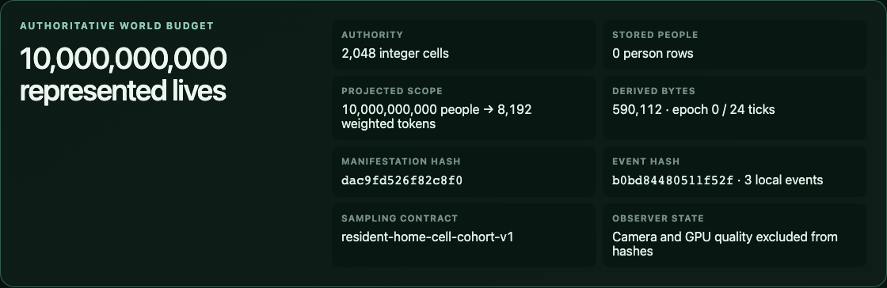
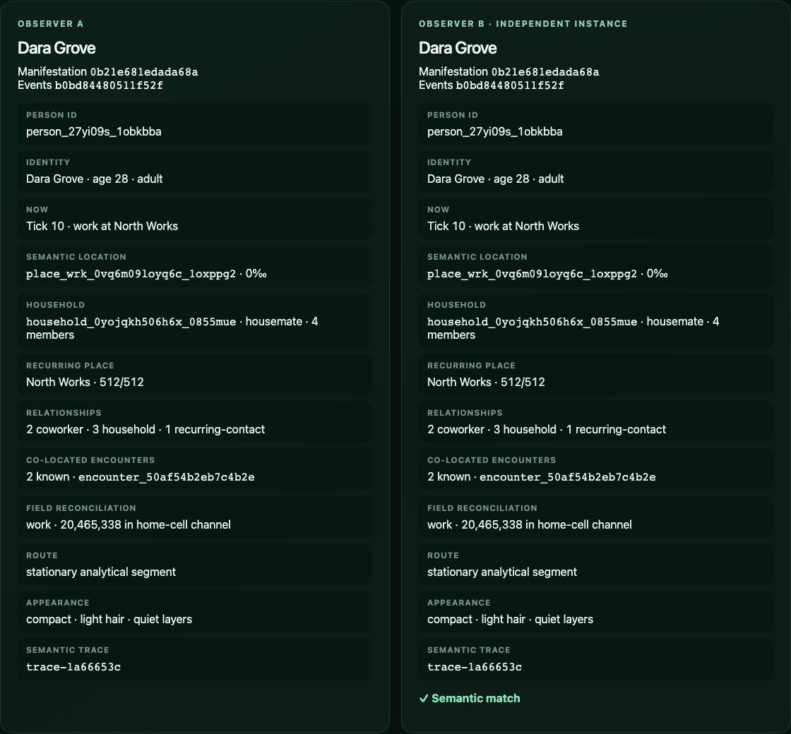
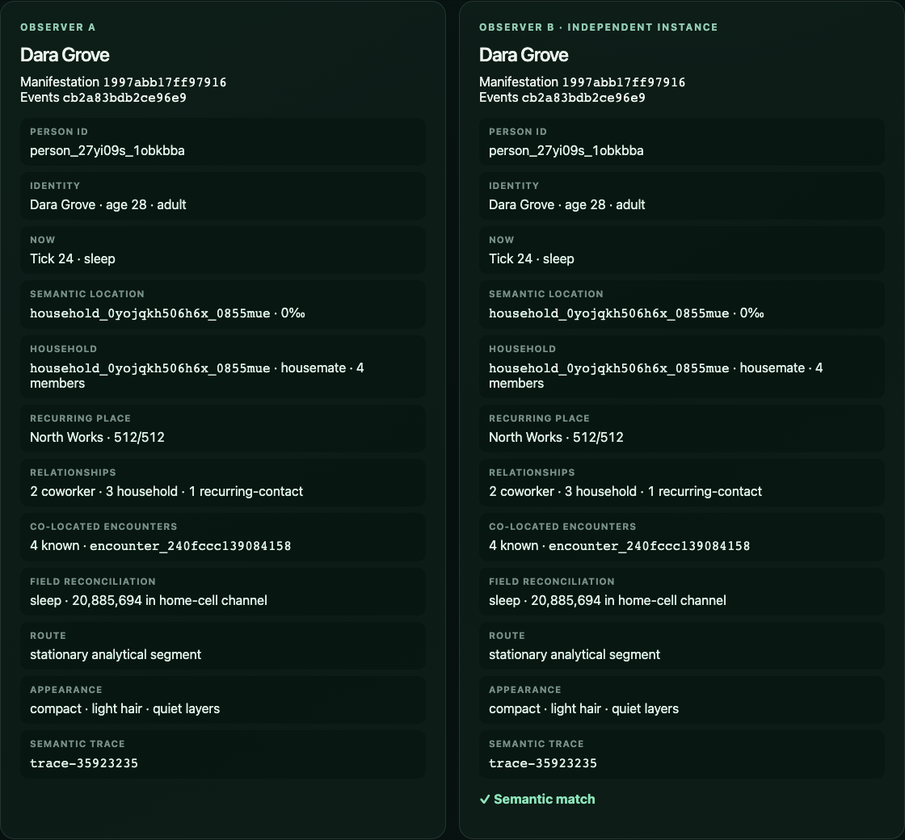
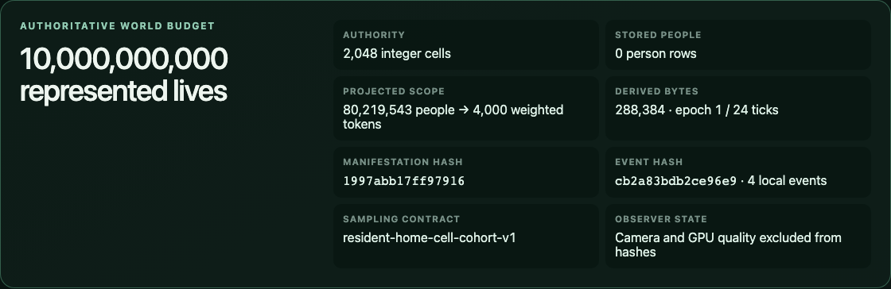

# Issue 14 evidence — stable weighted manifestations

## Sampling and authority contract

`resident-home-cell-cohort-v1` partitions the queried resident field into a
canonical `(cellId, cohort)` order. It assigns at least one deterministic token
to every nonempty stratum, then apportions the remaining LOD budget by exact
largest remainder. Ordered integer weights cover every resident exactly once;
when a stratum population fits the budget, every weight is one. The planet
profile therefore represents exactly 10,000,000,000 residents with 8,192
tokens, while the selected street cell represents 80,219,543 residents with
25,000 tokens and no unsampled remainder.

The CPU chooses opaque representative IDs and integer-permille transforms.
Camera path, frame rate, observer count, and quality are visual-only inputs and
do not enter semantic values or hashes. `visualJitterKey` may seed renderer
jitter but is not world authority. Selected identities are pinned at weight one
across LODs. A 24-tick identity epoch rotates one eighth of unpinned slots at a
time; all other representatives persist.

Arrivals and festival events come directly from the selected analytical
itinerary point. Meetings are emitted only from relationships that the
itinerary layer independently confirms are reciprocal and co-located. GPU work
consumes the CPU projection hash and never authors identities, transforms,
weights, or events.

## Determinism, reconciliation, and continuity

- `pnpm projection:vector` produced identical 3,556-byte output in two fresh
  Node processes (SHA-256
  `85e3565a45b0672e39dd778f68d4155418d5c022e87de44ee65d5ba48132122b`).
- Independent engines produced manifestation hash `b7d8ef2246775f8b` and
  event hash `b0bd84480511f52f` despite different observer, camera, frame-rate,
  and quality inputs.
- Street token weights reconcile exactly: young 17,648,299; adult 49,736,117;
  older 12,835,127. The CPU suite also reconciles all 6,144 planet-level
  cell/cohort strata to the ten-billion field.
- The planet→region→street→person→planet vector keeps the selected person in
  every LOD and returns to the same planet hash `7228cd2a2ca522b6`.
- Across tick 23→24, exactly 7,000/8,000 region tokens persist (87.5%), the
  selected person remains present, and the epoch advances from 0 to 1.
- [`illusion-projection.json`](../../../benchmarks/results/illusion-projection.json)
  retains the observer comparison, per-cohort reconciliation, LOD re-entry,
  epoch report, workload, and enforced budgets.

## Measured profile

`pnpm benchmark:projection` ran the production projection on the committed
Apple M1 Max local profile. Values below are the final same-profile run.

| Measurement                        |    Result |      Budget |
| ---------------------------------- | --------: | ----------: |
| Street projection p50 (25k tokens) | 223.72 ms |           — |
| Street projection p95              | 252.22 ms |   <= 500 ms |
| Planet projection p50 (8,192)      |  80.00 ms |           — |
| Planet projection p95              |  82.68 ms |   <= 500 ms |
| Two independently built observers  | 473.82 ms | <= 1,000 ms |
| Retained projection heap           |  1.31 MiB |   <= 32 MiB |
| Estimated street projection        |  1.72 MiB |    <= 2 MiB |
| Epoch identity retention           |     87.5% |    >= 87.5% |

## Browser and visual evidence

`pnpm test:e2e` passed 8/8 production journeys in Chromium 151 and WebKit 26.5.
The journey verifies camera invariance, matching hashes from two independently
initialized engines, person→planet→person re-entry, exact planet budget, and
selected-person continuity at tick 24. The forced Canvas fallback remains
navigable; renderer backend choice is outside semantic authority.

The screenshots were captured from the production build with
`node scripts/capture-projection.mjs` and inspected at original resolution.

## Final checks

- `pnpm check`: passed formatting, lint, all workspace type checks, contract
  checks, 14 unit files / 69 tests, and the production build.
- `pnpm test:e2e`: passed 8/8 across Chromium and WebKit.
- `pnpm benchmark:projection`: all projection, memory, and continuity budgets
  passed.
