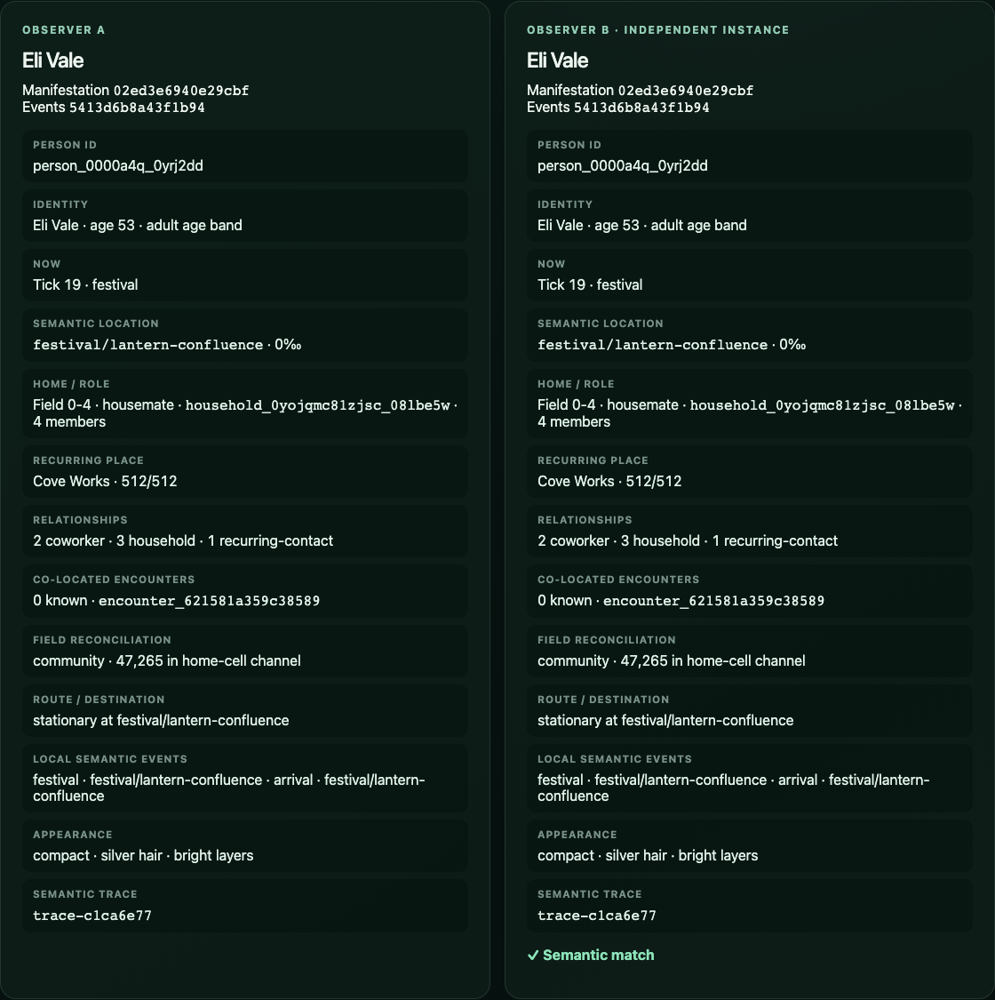
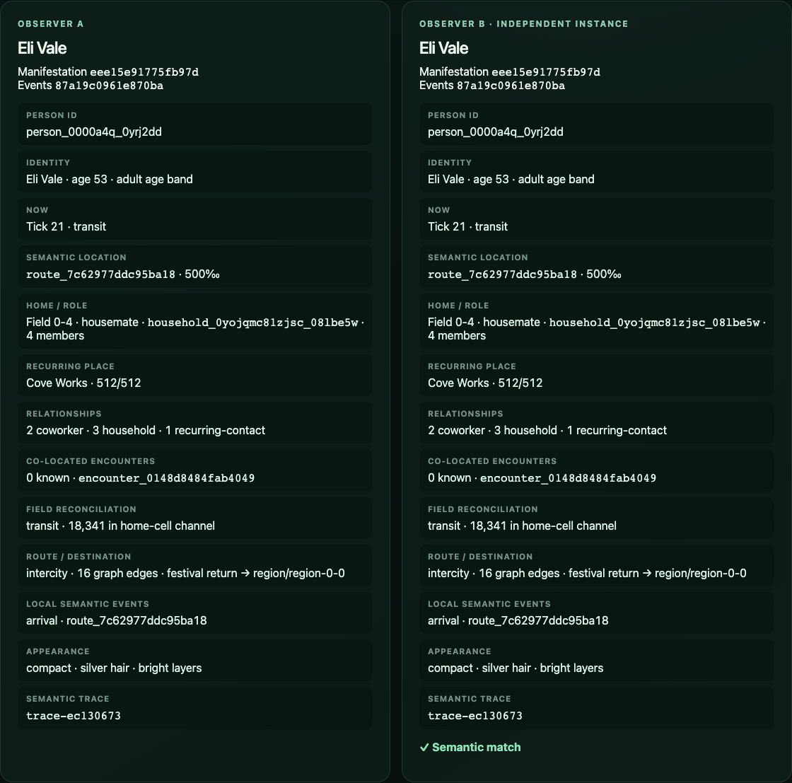
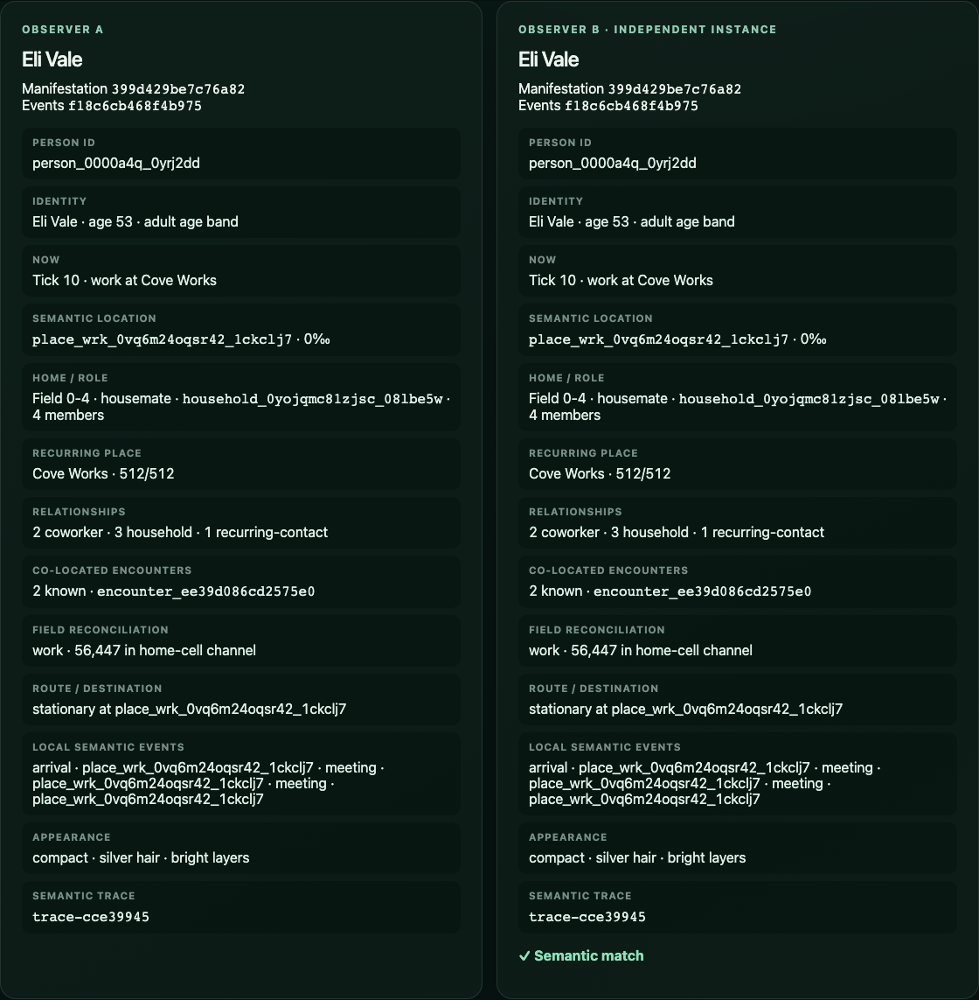
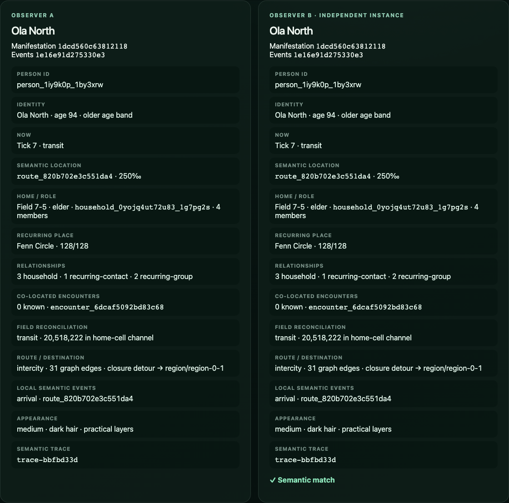
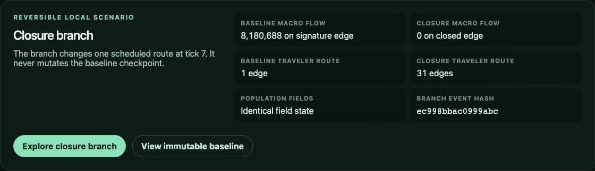
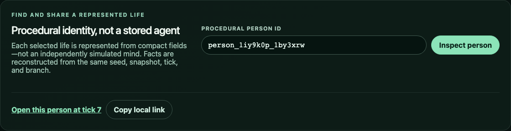

# Issue 15 evidence — local person experience

## Complete local journey

The production app now supports one continuous, reversible path:

1. Navigate planet → settlement → street with native buttons, then activate the
   highlighted street manifestation by pointer, Enter, or Space.
2. Inspect a procedural identity's stable name, exact age and age band,
   household role, home, recurring place and contacts, current schedule,
   semantic destination, route, field membership, appearance, events, and
   hashes. Every displayed fact is read directly from identity, itinerary,
   relationship, field, and projection queries.
3. Search an opaque person ID with a native search form and follow the same ID
   through direct analytical tick queries and LOD departure/re-entry.
4. Open or copy a versioned local link containing the baseline seed, schema,
   tick, person ID, and branch. A fresh page reconstructs the same person and
   manifestation hash. Incompatible or incomplete links render a local recovery
   screen without partially applying state.
5. Initialize Observer B from a fresh illusion engine. Both panes receive the
   same seed, branch state, tick, and query and visibly agree on identity,
   itinerary, manifestation hash, event hash, and encounters.
6. Visit Lantern Tide as `person_0000a4q_0yrj2dd`: see recurring workplace
   meetings at tick 10, festival peak at tick 19, and a 16-edge festival-return
   itinerary at tick 21.
7. Explore the local closure branch as `person_1iy9k0p_1by3xrw`. At tick 7 the
   immutable baseline carries 8,180,688 people over the direct signature edge
   and the selected itinerary uses one edge; the branch closes that edge, sends
   zero flow through it, and derives a 31-edge detour. The resident field hash
   stays identical, and returning to baseline reconstructs the direct route.

The branch has its own event hash and cache. It never mutates the no-event
baseline kernel, and neither view stores or steps a per-person agent.

## Deep links and failure behavior

`apps/web/src/experience.test.ts` verifies round-trip serialization and rejects
wrong schema, seed, tick, person checksum, and branch values with actionable
messages. The Playwright test opens the generated link in a second page within
the browser context and compares the person and manifestation hash. It then
opens an incompatible schema in a third page, verifies the recovery alert, and
returns to the clean baseline.

The current local link schema intentionally accepts only
`ten-billion-lives/baseline/v1`, schema 1, ticks 0–1,000,000, valid opaque person
IDs, and `baseline` or `closure`. This is a local view format, not a network or
sharing service.

## Truthful product copy

`pnpm experience:copy-check` verifies seven required statements and rejects
three misleading mind/sentience claims. The visible UI says:

- “represented lives,” not ten billion simulated people;
- “Procedural identity, not a stored agent”;
- each selected life is “represented from compact fields—not an independently
  simulated mind”;
- zero person rows are stored;
- baseline and closure branch names are explicit; and
- the branch never mutates the baseline checkpoint.

## Performance

`pnpm benchmark:experience` builds and launches the production app in Chromium
151, writes
[`person-experience.json`](../../../benchmarks/results/person-experience.json),
and enforces these same-profile budgets:

| Measurement                     |      Result |      Budget |
| ------------------------------- | ----------: | ----------: |
| Planet-to-person journey        | 1,876.50 ms | <= 5,000 ms |
| Follow tick p50                 |   229.84 ms |           — |
| Follow tick p95                 |   262.07 ms | <= 1,500 ms |
| Initialize independent observer |   129.69 ms | <= 2,000 ms |
| Fresh deep-link load            | 1,037.28 ms | <= 3,000 ms |
| Browser heap after full journey |   82.40 MiB |  <= 128 MiB |
| Retained person rows            |           0 |           0 |

Immutable projection caching reduced the WebKit primary journey from a
30-second pre-cache timeout to 6.0 seconds without changing semantic hashes or
adding person state.

## Browser and visual evidence

`pnpm test:e2e` passed 12/12 production journeys across Chromium 151 and WebKit
26.5. The new journeys cover pointer selection, keyboard search, fresh-session
links, incompatible-link recovery, two local observers, festival peak and
departure, stable meetings, branch consequences, baseline restoration, and
truthful copy. Native buttons, links, form controls, and the focus-visible
street surface provide both keyboard and pointer operation.

Screenshots were captured from the production Canvas fallback with
`node scripts/capture-experience.mjs` and inspected at original resolution.

## Final checks

- `pnpm check`: passed formatting, lint, workspace type checks, contracts, 15
  unit files / 73 tests, and the production build.
- `pnpm test:e2e`: passed 12/12 in Chromium and WebKit.
- `pnpm benchmark:experience`: all interaction, load, and memory budgets passed.
- `pnpm experience:copy-check`: 7 required claims present; 3 misleading claims
  absent.
