# Issue 21 evidence — local observatory polish

## Outcome

The production app now opens with a truthful one-screen explanation of the
concept and exposes the whole local journey without documentation:

- exactly 10,000,000,000 **represented lives**, explicitly not a table of
  people;
- a numbered Planet → Settlement → Street → Person path with short contextual
  guidance;
- pause/play, one-tick step, and 1×/6×/24× analytical time controls with visible
  day/hour and pressed rate;
- local-only discovery for Brindle Bay, Harbor Street, and Lantern Tide, plus a
  useful no-result state that does not mutate semantic state;
- visibly distinct immutable-baseline, replay-verified, and closure-branch
  modes;
- a reality budget containing authoritative integer cells and checkpoint bytes,
  zero stored person rows, represented scope, weighted visible tokens, tick,
  state/event hashes, frame time, backend, and observer sampling contract; and
- clear loading, Canvas fallback, empty discovery, incompatible-link, and
  runtime failure states.

The first visual inspection exposed an inconsistent generated heading (“Devale
0”) behind the Brindle Bay control and a raw neighborhood ID behind Harbor
Street. The retained screenshots were rejected, the visible canonical names
were aligned while keeping stable semantic IDs in links/diagnostics, and the
capture was rerun.

## Local time, semantics, and URLs

The clock changes the selected analytical tick; it never steps resident agents.
The capture selected 24×, started at tick 10, waited one local clock interval,
and observed exactly tick 34 before pausing. Existing camera-invariance,
deterministic replay, and two-observer assertions remain green.

Schema-1 local links now include `seed`, `tick`, `person`, `branch`, `stage`, and
`location`. Legacy schema-1 person links without stage/location remain valid and
derive the person stage/cell. New links reject incomplete, malformed, unknown,
or person-mismatched location context. A fresh browser page reconstructed the
same festival person at tick 19 from the generated location-aware link.

## Comprehension evidence

[`comprehension-checklist.json`](comprehension-checklist.json) ties seven
first-visit questions to visible, asserted production UI:

1. what the ten-billion claim means;
2. where the visitor is in the journey;
3. whether local time is running and at what rate;
4. how to find a place or event;
5. what is authoritative versus projected;
6. whether the view is baseline, replay, or branch; and
7. whether the complete experience remains available on Canvas/narrow devices.

All seven passed. Copy stays peaceful and culturally neutral, calls identities
procedural representations rather than minds/agents, and says no network index
or request is used.

## Browser and interaction results

Commands:

```sh
pnpm check
pnpm test:e2e
pnpm evidence:observatory
pnpm evidence:observatory:playwright
pnpm benchmark:experience
pnpm experience:copy-check
```

[`playwright-summary.json`](playwright-summary.json) records 14/14 passing
production journeys with no retry or flake: 7/7 in Chromium 151 and 7/7 in
WebKit 26.5. The new journey asserts first-run copy, time modes, successful and
empty discovery, canonical narrative labels, stage/location URLs, complete
budget diagnostics, and fresh-session reconstruction. Existing deterministic,
festival, branch, two-observer, invalid-link, renderer-loss, reduced-motion, and
390×844 fallback journeys all remain green.

The post-change production experience benchmark passed every existing budget:

| Measurement                     |      Actual |     Budget |
| ------------------------------- | ----------: | ---------: |
| Planet-to-person journey        | 1,731.19 ms | ≤ 5,000 ms |
| Follow tick p95                 |   258.68 ms | ≤ 1,500 ms |
| Initialize independent observer |    93.89 ms | ≤ 2,000 ms |
| Fresh location-aware link load  |   960.99 ms | ≤ 3,000 ms |
| Browser heap                    |   82.40 MiB |  ≤ 128 MiB |
| Retained person rows            |           0 |          0 |

The production bundle is 96.02 kB JavaScript (30.52 kB gzip) and 14.50 kB CSS
(4.13 kB gzip).

## Retained recordings and visual states

[`observatory-desktop.webm`](observatory-desktop.webm) is the uninterrupted
1440×1000 desktop journey (VP8, 25 fps, 8.16 s, SHA-256
`ce583156ef14d751395624b2d0b03ef31e17dbaf220770b47c6213ea266ec9f8`).
[`observatory-narrow.webm`](observatory-narrow.webm) is the uninterrupted
390×844 reduced-motion journey (VP8, 25 fps, 6.36 s, SHA-256
`c55cdc784756a4b6c6b7d0b3b3e1feb4a479d3bffd1f1fd4c7e2855afef17bcb`).

Both recordings and every screenshot below were inspected at original
resolution. Desktop and narrow views had no horizontal overflow, clipped
controls, obscured state, or misleading identity transition. Focus, status,
hash, count, and mode cues remain non-color-only.

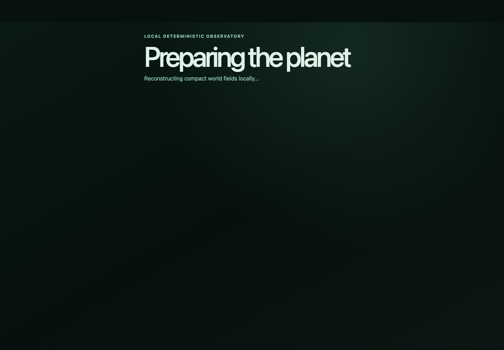

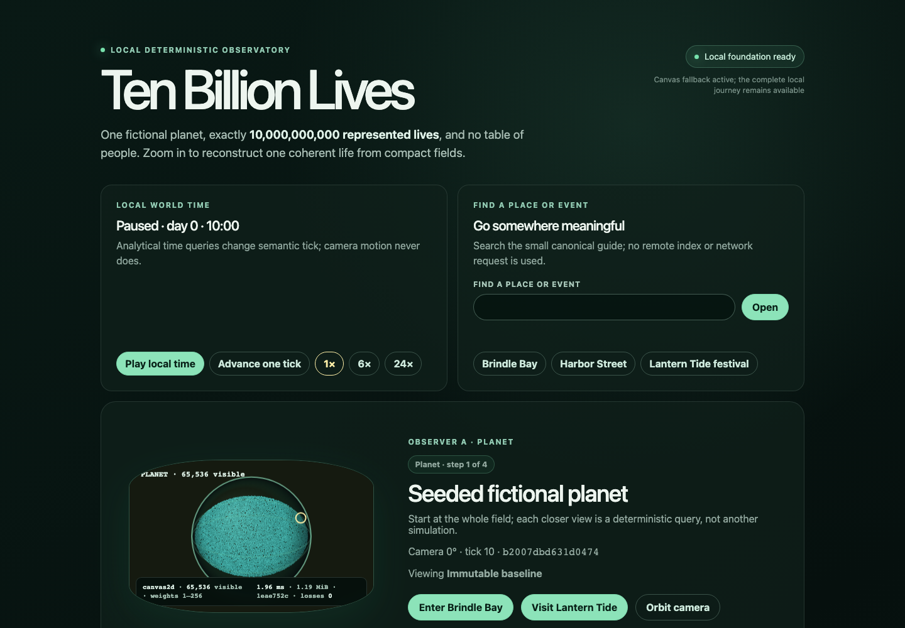

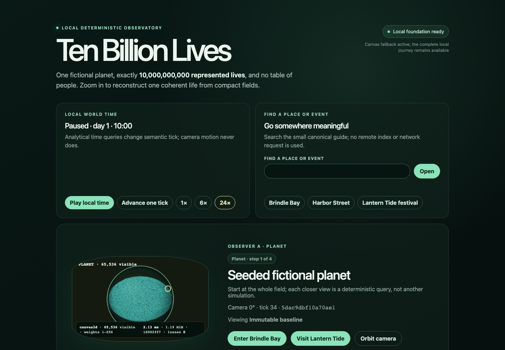

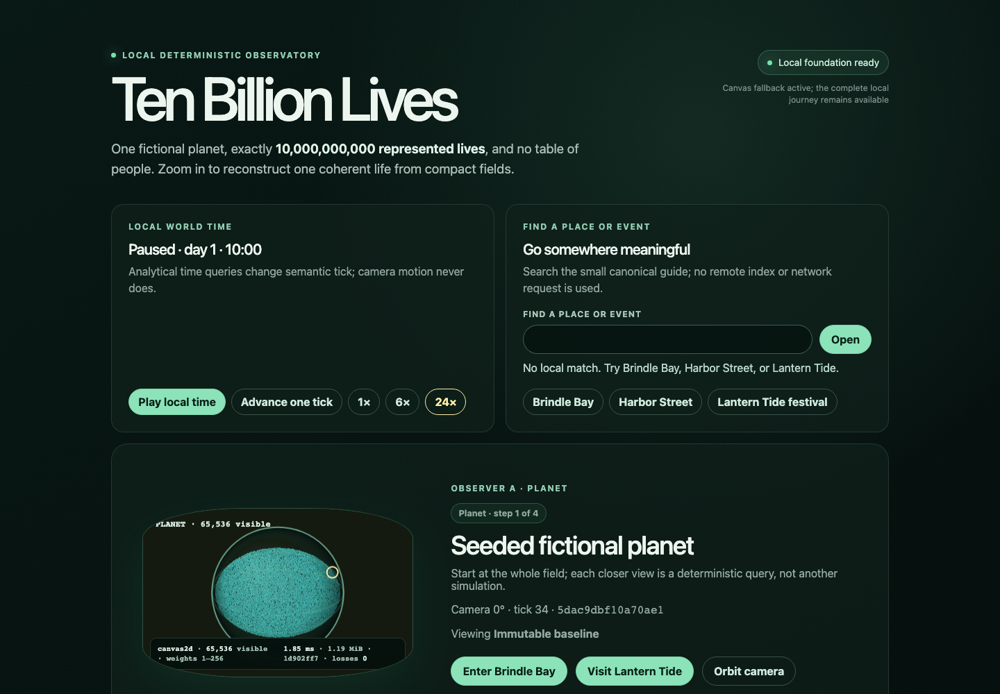

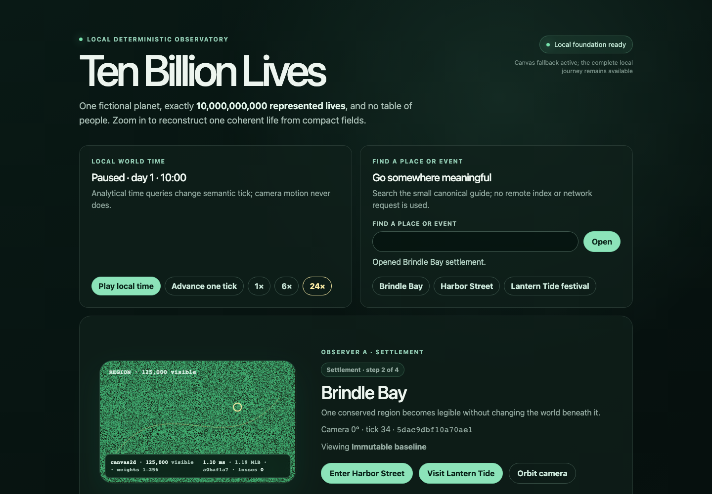

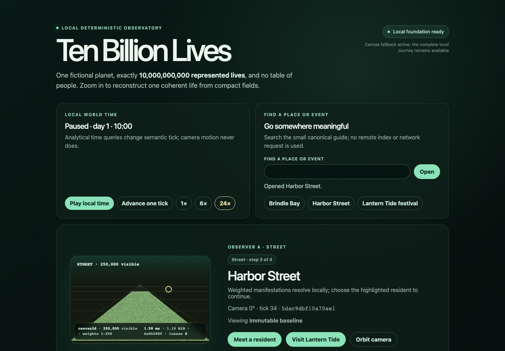

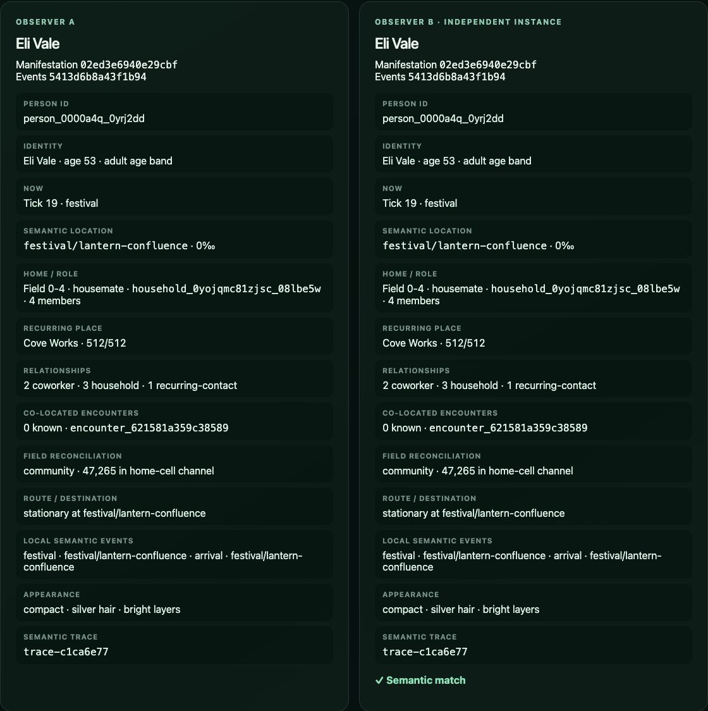

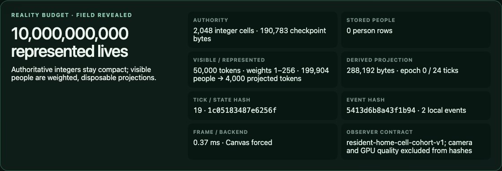

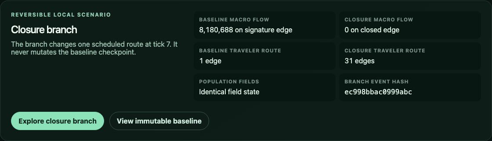

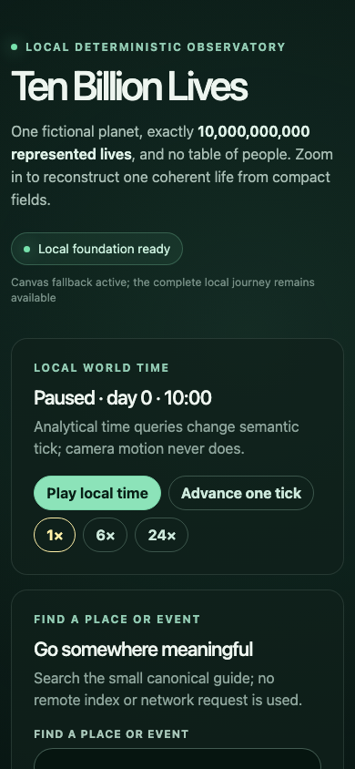

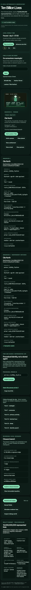

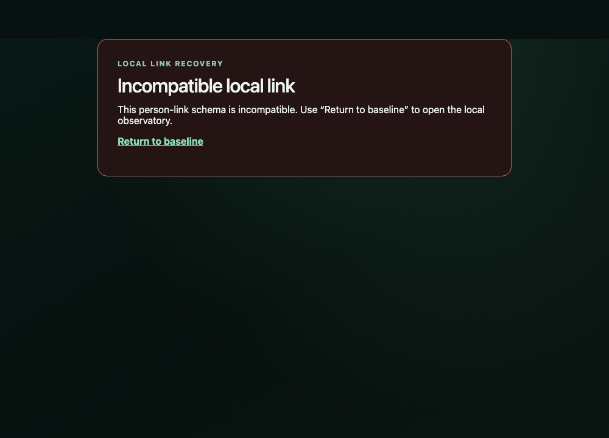

No networking, telemetry, authentication, server, CI, Pages, container,
deployment, cloud service, paid API, or runtime LLM behavior was added.
